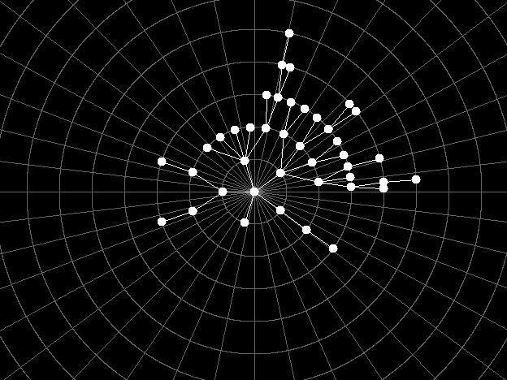
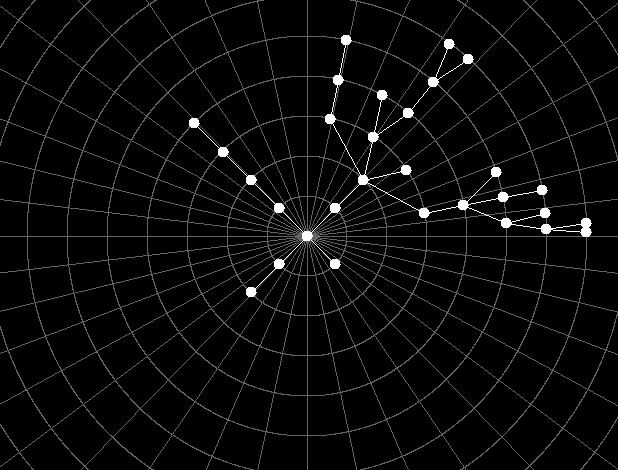

# c_trees

Biblioteca em C para desenho de árvores.





Documentação do SDL: http://wiki.libsdl.org/CategoryInit
Tutorial de SDL (com preparação): https://www.youtube.com/watch?v=yFLa3ln16w0&ab_channel=CS50

# Preparação (Linux)

```shel
$ sudo apt-get update
$ sudo apt-get install libsdl2-2.0-0 libsdl2-dbg libsdl2-dev libsdl2-image-2.0-0 libsdl2-image-dbg libsdl2-image-dev
```

> obs: caso ocorram os erros:
> E: Unable to locate package libsdl2-dbg
> E: Unable to locate package libsdl2-image-dbg
> ainda será possível executar o programa de exemplo

# Compiling and running

```shell
$ make
$ ./main
```
